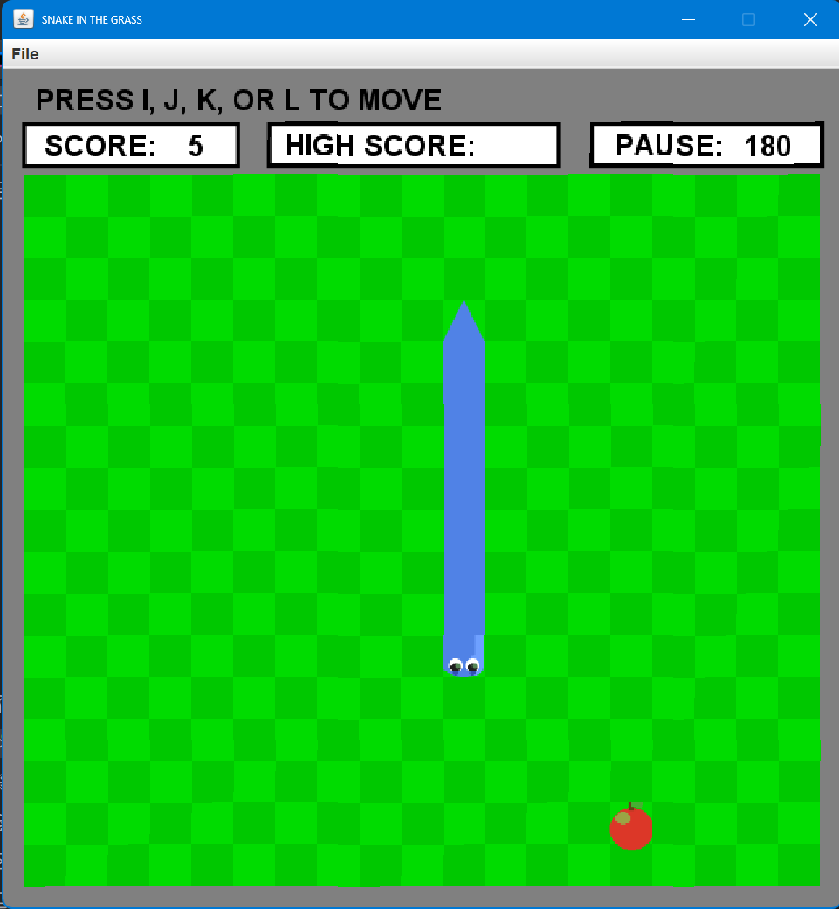

# Snake Game

A classic Snake game built in Java, written during high school. The game runs in a custom graphics window using [StdDraw](https://introcs.cs.princeton.edu/java/stdlib/StdDraw.java.html) from Princeton's *Introduction to Programming in Java* library.

---

## Preview

The game features a green-tiled 19×17 board, a segmented animated snake with head/body/tail sprites, and a red apple to chase. Score and high score are tracked at the top of the window.


---

## How to Run

**Requirements:** Java 8 or higher.

```bash
# Compile all files
javac SnakeGame.java SnakeCell.java CoordinatePair.java StdDraw.java

# Run with default settings (small snake, 180ms speed)
java SnakeGame

# Run with arguments: java SnakeGame <smallSnake> <pauseTime>
# smallSnake: true (short snake) or false (big snake that fills board)
# pauseTime:  milliseconds between frames — lower = faster
java SnakeGame true 150
java SnakeGame false 100
```

> Make sure all `.png` image files are in the **same directory** as the compiled `.class` files.

---

## Controls

| Key | Action |
|-----|--------|
| `I` | Move Up |
| `K` | Move Down |
| `J` | Move Left |
| `L` | Move Right |
| `P` | Pause |
| `R` | Reset (after Game Over) |

---

## File Structure

```
SnakeGame/
├── SnakeGame.java          # Main game logic and entry point
├── SnakeCell.java          # Individual board cell (holds apple state)
├── CoordinatePair.java     # Ordered pair + Direction enum
├── StdDraw.java            # Graphics library (see credits below)
├── apple.png               # Apple sprite
├── snakehead.png           # Snake head sprite
├── snaketail.png           # Snake tail sprite
├── snakebodystraight.png   # Straight horizontal body segment
├── snakebodystraightup.png # Straight vertical body segment
├── snakebodyturn.png       # Corner/turn body segment
└── README.md
```

---

## How It Works

- The **board** is a 19×17 2D array of `SnakeCell` objects. Each cell knows whether it holds an apple.
- The **snake** is an `ArrayList<CoordinatePair>` — the first element is the head, the last is the tail.
- Each frame, the game checks if the snake can move forward. If it can, the head is prepended and the tail removed (unless an apple was eaten, in which case the tail stays — growing the snake).
- Sprites are drawn with rotation to handle all four directions for the head and tail, and straight vs. corner segments for the body.

---

## Credits

- **StdDraw.java** — Graphics library by Robert Sedgewick and Kevin Wayne, Princeton University.  
  Source: https://introcs.cs.princeton.edu/java/stdlib/StdDraw.java.html  
  Used here unchanged, as permitted for educational use.

---

## Author

**Soham Pal** — high school project, 2023.
